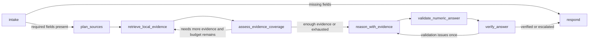

# GTM Diligence Assistant

This repo contains a LangChain + LangGraph take-home project for an internal GTM / deal-desk use case, now wrapped in a small demo-ready web app.

An operator asks a finance diligence question against a local virtual dataroom, the workflow searches the company FY folder with a strong bias toward one primary filing, retrieves page-window evidence from a precomputed vector index, falls back to exact scans and bounded whole-file reads only when semantic retrieval still leaves gaps, has the model identify operands and propose a formula, validates the arithmetic deterministically, verifies the answer, and escalates to human review instead of bluffing when evidence is incomplete.

## Problem and User

The user is an internal GTM, deal-desk, or solutions engineer supporting diligence-heavy workflows. They need:

- A reliable answer path over local financial PDFs.
- Clear citations they can inspect quickly.
- Predictable failure behavior when evidence is incomplete.
- A workflow that is easy to explain, trace, and improve over time.

This implementation favors model-led reasoning plus an explicit retrieval/verification graph over a free-form agent loop so the system is easier to explain in a walkthrough and easier to operate with LangSmith. The model decides what operands and formula are needed, an explicit coverage-assessment node decides whether another local retrieval pass is needed, and a small generic numeric validator checks arithmetic and answer formatting before the workflow returns a number. Retrieval is intentionally recall-first but primary-file-biased: the workflow tries hard to answer from one 10-K or annual report using semantic page-window retrieval before it falls back to exact scans, whole-file reads, or support PDFs.

## Docker Runtime

The primary runtime is a sandboxed Docker setup:

- code mounted at `/app`
- dataroom mounted read-only at `/data`
- curated eval dataset mounted read-only at `/inputs`
- outputs written to `/outputs`

The container entrypoint starts a FastAPI backend that serves both the API and a compiled React/Vite frontend. Before the app accepts requests, it builds or refreshes the vector indexes for the company/FY folders referenced by the curated example dataset so the demo loads in the same `/data` and `/outputs` path context it will later use at runtime.

### Quick Start

1. Copy [`.env.example`](./.env.example) to `.env` and set at least one model API key plus an embedding provider.
2. Install the repo dependencies into the local virtualenv.
3. Build and run the container, then open the UI in a browser.

```bash
cp .env.example .env
uv sync
docker compose up --build
```

Open [http://localhost:8000](http://localhost:8000).

Embedding index defaults:

- `EMBEDDING_CHUNK_SIZE=16` keeps OpenAI embedding batches under the per-request token cap for large filings.
- `EMBEDDING_DOC_MAX_CHARS=12000` clips only the vectorized page-window text, not the later exact page reads used for citations and reasoning.
- `EMBEDDING_ADD_BATCH_SIZE=8` adds documents to the vector store in smaller batches so one provider hiccup does not fail an entire FY-folder build.
- `EMBEDDING_BATCH_MAX_RETRIES=4` with `EMBEDDING_BATCH_BACKOFF_SECONDS=2` retries transient embedding failures before giving up.

Subsequent runs:

```bash
docker compose up
```

During startup the container will:

1. Read the runtime JSONL dataset from `/inputs`
2. Resolve the unique `company/FY` folders referenced by dataset `metadata`
3. Build or refresh only those indexes under `/outputs/vector_indexes`
4. Start the web app on `http://localhost:8000`
5. Continue in degraded exact-scan mode if embeddings or some folder builds fail

Mounted inputs:

- [`inputs/diligence_eval_examples.jsonl`](./inputs/diligence_eval_examples.jsonl): curated local-only JSONL fixture used at runtime
- [`dataroom/`](./dataroom): mounted as `/data` for local filing retrieval

The startup health endpoint at `/api/health` reports:

- whether the workflow is ready
- whether UI assets are enabled
- how many examples were loaded
- the index-prep summary and any startup error

### Local Dev

Backend:

```bash
uv run gtm-diligence-web
```

Frontend:

```bash
cd frontend
npm install
npm run dev
```

The Vite dev server proxies `/api` to `http://127.0.0.1:8000`.

### API

The demo backend exposes:

- `GET /api/health`
- `GET /api/examples`
- `POST /api/run`

`POST /api/run` accepts the existing [`DiligenceRequest`](./gtm_diligence_assistant/models.py) shape and returns:

```json
{
  "response": {
    "final_answer": "7682.00",
    "answer_kind": "number",
    "explanation": "...",
    "citations": []
  },
  "telemetry": {
    "retrieval_stop_reason": "coverage_complete"
  }
}
```

The backend keeps execution synchronous in v1 and uses the same workflow, model selection, embedding configuration, dataroom root, and vector index cache settings as the CLI. First-party callers only need to send `question` and `request_id`; the runtime infers `company` and `fiscal_year` from the question and dataroom structure, while still accepting explicit overrides for backward compatibility.

## Dataset Contract

The curated JSONL fixture is the only dataset the take-home flow consumes at runtime.

Each line follows this pattern:

```json
{
	"id": "example-id",
	"inputs": {
		"question": "What is Roper Technologies's net debt as of the FY 2024 10-K?",
		"request_id": "eval-qid-6"
	},
	"outputs": {
		"expected_kind": "number",
		"expected_value": 7682000000.0,
		"correct_any_of_files": ["Roper 2024 10K.pdf"]
	},
	"metadata": {
		"qid": 6,
		"company": "Roper Technologies",
		"fiscal_year": 2024
	}
}
```

Runtime boundary:

- `inputs` are the only fields passed into the agent workflow, and first-party callers keep that surface to `question` plus `request_id`.
- `outputs` and `metadata` remain grader-only and are used by evaluators and index-prep helpers, not by the runtime planner.
- `company` and `fiscal_year` are inferred inside the runtime from the question text, dataroom folders, and the intake step rather than being supplied by the frontend.
- The current take-home eval set is intentionally reduced to 5 local-only examples: `qid 4`, `qid 5`, `qid 6`, `qid 8`, and `qid 9`.

## LangGraph Design

The workflow uses explicit typed state plus named nodes instead of a black-box agent loop.



State lives in [`gtm_diligence_assistant/workflow.py`](./gtm_diligence_assistant/workflow.py) and carries:

- `request`
- `intake`
- `retrieval_plan`
- `coverage_assessment`
- `evidence`
- `evidence_pool`
- `citations`
- `reasoned_answer`
- `validation_result`
- `final_response`
- `attempt_count`
- `retrieval_iteration`
- `empty_retrieval_pass_count`
- `last_retrieval_added_count`
- `retrieval_stop_reason`
- `vector_hits_count`
- `vector_index_used`
- `vector_primary_hit_rank`
- `vector_retrieval_queries`
- `status`
- `errors`
- `seen_query_fingerprints`
- `searched_file_query_pairs`
- `opened_files`
- `deep_read_files`
- `full_text_fallback_used`
- `coverage_notes`

Deterministic tools live in [`gtm_diligence_assistant/tools.py`](./gtm_diligence_assistant/tools.py):

- `scan_pdf_pages`: scans every page in a local PDF and surfaces exact phrase, alias, regex, and token-bundle matches.
- `search_document_pages`: lightweight keyword-ranking fallback, no longer the primary gatekeeper.
- `read_pdf_pages`: extracts exact one-based pages from a PDF without clipping unless a cap is explicitly requested.
- `get_full_pdf_text`: bounded whole-file fallback for the most promising local filing when page scans still miss an operand.

Precomputed vector indexing lives in [`gtm_diligence_assistant/vector_index.py`](./gtm_diligence_assistant/vector_index.py):

- page-window `Document` creation centered on each PDF page
- one dumped `InMemoryVectorStore` per company/FY folder
- source fingerprint checks so unchanged PDFs do not rebuild
- metadata for `file_path`, `file_name`, `center_page`, `window_start`, and `window_end`

The web entrypoint lives in [`gtm_diligence_assistant/web_app.py`](./gtm_diligence_assistant/web_app.py):

- loads the curated examples used by the demo picker
- prepares dataset-scoped vector indexes at startup
- initializes the workflow once per backend process
- serves the API plus the compiled frontend from one FastAPI app

The Docker-first batch utility still lives in [`gtm_diligence_assistant/docker_runtime.py`](./gtm_diligence_assistant/docker_runtime.py) for non-UI batch runs and eval-style debugging.

Task planning lives in [`gtm_diligence_assistant/task_planning.py`](./gtm_diligence_assistant/task_planning.py):

- request-level task normalization
- retrieval query expansion for local evidence
- missing-field filtering so retrievable finance facts do not block the graph

Generic numeric validation lives in [`gtm_diligence_assistant/numeric_validation.py`](./gtm_diligence_assistant/numeric_validation.py):

- safe formula evaluation over model-declared operands
- answer-format validation for numbers and percents
- arithmetic mismatch detection before the final response
- incomplete-evidence validation for citation-backed `unknown` answers

Prompt context remains intentionally capped. The workflow keeps a larger deduped evidence pool across passes, but the model only sees a ranked evidence pack of the best chunks for the current step. That prompt pack is primary-file-biased and keeps operand-bearing chunks plus a small amount of nearby statement or note context instead of every retrieval event. The retrieval loop now uses page-window vector retrieval first, exact page scanning second, and whole-file fallback last so the workflow is less likely to miss debt or lease notes that were present but phrased differently from the question.

## Secondary CLI Utilities

The web UI is the primary demo path, but the CLI utilities remain available for debugging, batch runs, and evals.

Manual index refresh:

```bash
uv run python -m gtm_diligence_assistant.build_index --company Adobe --fy 2024
```

Single request:

```bash
uv run python main.py --question "What is Adobe's net debt as of FY 2024?" --pretty
```

Batch run:

```bash
uv run python -m gtm_diligence_assistant.batch
```

## LangSmith

The code paths for tracing and eval are implemented, and the final take-home submission should include real traces plus at least one real evaluation experiment.

Set:

```bash
LANGSMITH_TRACING=true
LANGSMITH_API_KEY=...
LANGSMITH_PROJECT=gtm-diligence-assistant
```

Suggested walkthrough traces:

- a happy-path local-only run such as `qid=6`
- a local run that clearly triggers the retrieval loop, such as `qid=9` or `qid=8`

Recommended setup:

- use local `uv run ...` for LangSmith evals
- use `docker compose up --build` for the web app demo

Local eval run:

1. Build or refresh the local vector indexes:

```bash
uv run python -m gtm_diligence_assistant.build_index \
  --dataroom-root dataroom \
  --cache-dir .vector_indexes
```

2. Run the LangSmith experiment:

```bash
uv run python -m gtm_diligence_assistant.evals \
  --dataset-jsonl inputs/diligence_eval_examples.jsonl \
  --dataset-name gtm-diligence-assistant-local-v1 \
  --experiment-prefix gtm-diligence-assistant-local
```

The eval runner now treats the local JSONL as the source of truth for that LangSmith dataset, so reruns with the same `--dataset-name` are safe. You only need a new dataset name when you intentionally want a separate dataset.

Notes:

- Reusing the same `--dataset-name` is safe; the eval runner now syncs the LangSmith dataset idempotently from the local JSONL.
- The runner prints a `langsmith_dataset_sync` summary before the experiment starts so you can see how many examples were created, updated, deleted, or left unchanged.
- The local eval path is the recommended path for reliable LangSmith experiments right now; the Docker path is still best for the user-facing web app demo.

The eval runner includes deterministic evaluators for:

- numeric correctness within tolerance
- citation presence
- expected file behavior, which gives full credit for final alignment to the expected filing and partial credit when retrieval opened the right file but the final answer did not anchor to it

## Tradeoffs

- Primary-file-biased deep local retrieval: broader recall than a narrow single-pass flow, while still staying explicit and traceable in LangGraph.
- Local-only scope: much cleaner take-home story, but it drops the external-metric cases from the eval/demo.
- Structured output over free-form prose: tighter contracts for verification and evaluation.
- Hybrid reasoning plus generic validation over task-specific calculators: more general, while still catching arithmetic regressions.
- Precomputed page-window vectors over pure keyword search: better recall for financial phrasing drift, at the cost of an extra indexing step and embedding configuration.
- Partial `unknown` over guessed numbers when evidence is incomplete: lower answer coverage, better trust.

## Production Metrics

If this shipped in production, I would monitor:

- exact or near-correct answer rate
- citation coverage rate
- opened-expected-file rate
- primary-file-alignment rate
- `needs_human_review` rate
- retrieval iteration count
- p95 end-to-end latency
- retry rate in `verify_answer`

Regression gates after changes:

- no drop in exact or near correctness
- no drop in citation coverage
- no drop in expected-file open rate
- no drop in primary-file alignment
- no increase in human-review rate
- stable or lower average retrieval iterations
- stable p95 latency

## Known Limitations

- The take-home app is intentionally local-only. It does not fetch web data or provided URLs.
- The eval set is intentionally simplified to 5 local-only examples, which is below the original 5–20 example guidance.
- Retrieval depends on a local vector index. The Docker runtime now builds or refreshes those indexes before batch execution, but any folders that fail to index still fall back to exact scans and whole-file reads, which is slower and less reliable.
- The retrieval loop is bounded, even though it now searches more deeply: up to 10 passes with a 4-empty-pass stop budget.

## Next Steps

- Add better evidence diversity scoring so prompt packs cover more operand types with fewer chunks.
- Expand the local-only eval set with a few more internal-PDF questions if more time is available.

## Friction Log

- External URL support added complexity quickly, especially for a take-home where the core story is already strong with local PDFs.
- JSONL is a cleaner runtime and evaluation boundary for the take-home app than a spreadsheet-first flow.
